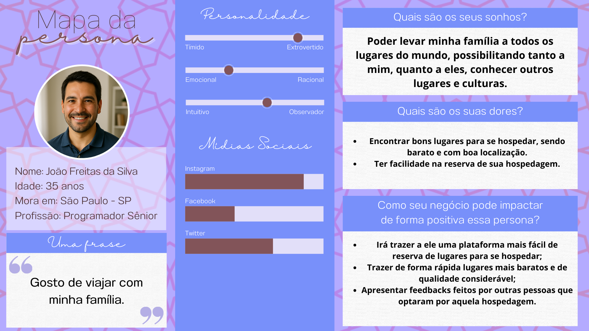
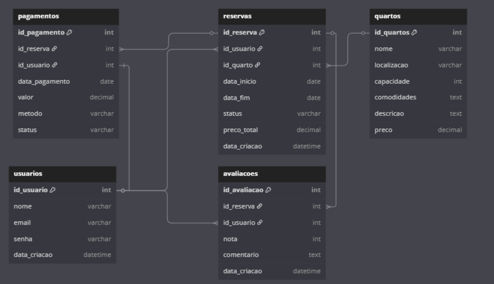
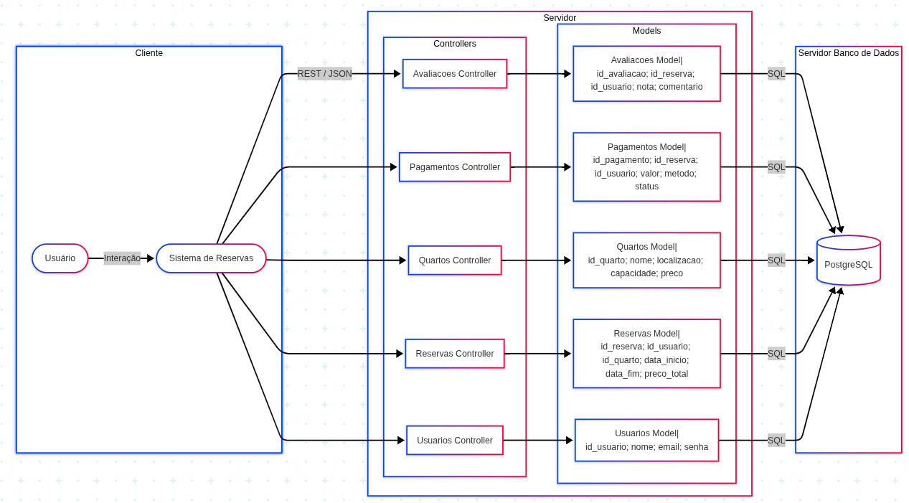

# Web Application Document - Projeto Individual - Módulo 2 - Inteli

**_Os trechos em itálico servem apenas como guia para o preenchimento da seção. Por esse motivo, não devem fazer parte da documentação final._**

## Nome do Projeto

#### Autor do projeto

## Sumário

1. [Introdução](#c1)  
2. [Visão Geral da Aplicação Web](#c2)  
3. [Projeto Técnico da Aplicação Web](#c3)  
4. [Desenv## 6. Referências

### Documentação Técnica
- **Node.js Documentation** - [https://nodejs.org/docs/](https://nodejs.org/docs/)
- **Express.js Guide** - [https://expressjs.com/](https://expressjs.com/)
- **PostgreSQL Documentation** - [https://www.postgresql.org/docs/](https://www.postgresql.org/docs/)
- **EJS Documentation** - [https://ejs.co/](https://ejs.co/)

### Arquitetura e Padrões
- **MVC Architecture Pattern** - Martin Fowler
- **RESTful API Design** - [https://restfulapi.net/](https://restfulapi.net/)
- **HTTP Status Codes** - [https://httpstatuses.com/](https://httpstatuses.com/)

### Frontend e CSS
- **MDN Web Docs - CSS** - [https://developer.mozilla.org/en-US/docs/Web/CSS](https://developer.mozilla.org/en-US/docs/Web/CSS)
- **CSS Grid Guide** - [https://css-tricks.com/snippets/css/complete-guide-grid/](https://css-tricks.com/snippets/css/complete-guide-grid/)
- **Flexbox Guide** - [https://css-tricks.com/snippets/css/a-guide-to-flexbox/](https://css-tricks.com/snippets/css/a-guide-to-flexbox/)

### JavaScript e APIs
- **Fetch API Documentation** - [https://developer.mozilla.org/en-US/docs/Web/API/Fetch_API](https://developer.mozilla.org/en-US/docs/Web/API/Fetch_API)
- **JavaScript ES6+ Features** - [https://es6-features.org/](https://es6-features.org/)

### Ferramentas de Desenvolvimento
- **npm Documentation** - [https://docs.npmjs.com/](https://docs.npmjs.com/)
- **Git Documentation** - [https://git-scm.com/doc](https://git-scm.com/doc)

---
---nto da Aplicação Web](#c4)  
5. [Referências](#c5)  

 

## 1. Introdução (Semana 01)

O sistema que será desenvolvido tem como foco principal oferecer uma plataforma prática e intuitiva para reserva de quartos. A proposta é permitir que o usuário realize suas reservas de forma fácil, rápida e segura, sem complicações, diretamente pelo site.

A aplicação permite que o usuário visualize os quartos disponíveis, veja detalhes como preço, comodidades e tipo de acomodação, e escolha a opção que melhor atende às suas necessidades. Além disso, o sistema fornece feedbacks claros sobre a confirmação da reserva e dá ao usuário a possibilidade de deixar comentários e avaliações sobre os quartos escolhidos, contribuindo para a experiência de outros visitantes.

Outro diferencial importante é a funcionalidade de pagamento online integrado, que permite que todo o processo seja feito em um só lugar, garantindo mais agilidade e conforto ao usuário.

O projeto é construído com base no padrão de arquitetura MVC (Model-View-Controller), que organiza o sistema em três partes: o Model, que gerencia os dados das reservas e dos quartos; o View, que cuida da interface e da exibição das informações; e o Controller, que liga tudo isso, processando as ações do usuário e coordenando as respostas do sistema.

Essa separação facilita a manutenção, a expansão futura do projeto e melhora a organização do código. O sistema não só atende a uma necessidade prática, como também serve como base sólida para o aprendizado e aplicação de boas práticas de desenvolvimento web.

---

## 2. Visão Geral da Aplicação Web

### 2.1. Personas (Semana 01 - opcional)

  

### 2.2. User Stories (Semana 01 - opcional)

*Posicione aqui a lista de User Stories levantadas para o projeto. Siga o template de User Stories e utilize a referência USXX para numeração (US01, US02, US03, ...). Indique todas as User Stories mapeadas, mesmo aquelas que não forem implementadas ao longo do projeto. Não se esqueça de explicar o INVEST de 1 User Storie prioritária.*

---

## 3. Projeto da Aplicação Web

### 3.1. Modelagem do banco de dados  (Semana 3)

  

### 3.1.1 BD e Models (Semana 5)
*Descreva aqui os Models implementados no sistema web*

### 3.2. Arquitetura (Semana 5)

Minha aplicação web segue a arquitetura MVC (Model-View-Controller), estruturada para separar responsabilidades e facilitar a manutenção e escalabilidade. Abaixo está o diagrama da arquitetura, com o fluxo de dados entre as camadas Model, Controller e View.

🔁 Explicação do Fluxo de Dados
Usuário/Cliente (Frontend ou API client) faz uma requisição HTTP (ex: GET /quartos).

Controller recebe a requisição, valida os dados e decide a ação.

O Controller chama a função apropriada do Model, passando os parâmetros necessários.

O Model executa comandos SQL puros diretamente no PostgreSQL e retorna os resultados.

O Controller recebe os dados do Model, aplica qualquer lógica adicional e prepara a resposta.

(Opcional) A View formata os dados caso haja uma interface. Neste sistema, a View pode ser entendida como a estrutura da resposta JSON.

A resposta é enviada de volta ao usuário/cliente.

🧱 Componentes da Arquitetura
Model: usuariosModel, quartosModel, reservasModel, avaliacoesModel, pagamentosModel

Controller: usuariosController, quartosController, reservasController, etc.

View: Como a aplicação é uma API REST, a view se refere à estrutura das respostas JSON enviadas ao cliente.

Banco de Dados: PostgreSQL com SQL puro

  

**Instruções para criação do diagrama de arquitetura**  
- **Model**: A camada que lida com a lógica de negócios e interage com o banco de dados.
- **View**: A camada responsável pela interface de usuário.
- **Controller**: A camada que recebe as requisições, processa as ações e atualiza o modelo e a visualização.
  
*Adicione as setas e explicações sobre como os dados fluem entre o Model, Controller e View.*

### 3.3. Wireframes (Semana 03 - opcional)

*Posicione aqui as imagens do wireframe construído para sua solução e, opcionalmente, o link para acesso (mantenha o link sempre público para visualização).*

### 3.4. Guia de estilos (Semana 05 - opcional)

*Descreva aqui orientações gerais para o leitor sobre como utilizar os componentes do guia de estilos de sua solução.*

### 3.5. Protótipo de alta fidelidade (Semana 05 - opcional)

*Posicione aqui algumas imagens demonstrativas de seu protótipo de alta fidelidade e o link para acesso ao protótipo completo (mantenha o link sempre público para visualização).*

### 3.6. WebAPI e endpoints (Semana 05)

Web API é um conjunto de endpoints que permitem que diferentes sistemas e aplicações se comuniquem entre si, compartilhando recursos e dados. Os endpoints são localizados dentro da estrutura da aplicação e são utilizados para realizar operações como criar, ler, atualizar e deletar dados (CRUD).

Tipos de solicitação
- GET: Recupera dados (ex.: lista de quartos, detalhes de uma reserva).

- POST: Cria um novo registro (ex.: novo usuário, nova reserva).

- PUT: Atualiza um registro existente (ex.: atualizar dados de uma avaliação).

- DELETE: Remove um registro (ex.: deletar um pagamento).

| Rota            | Método | Finalidade                             | Corpo / Resposta                          |
| --------------- | ------ | -------------------------------------- | ----------------------------------------- |
| `/usuarios`     | GET    | Lista todos os usuários                | Resposta: Array JSON de usuários          |
| `/usuarios/:id` | GET    | Retorna dados de um usuário específico | Resposta: JSON do usuário                 |
| `/usuarios`     | POST   | Cria um novo usuário                   | Corpo: JSON com dados (nome, email, etc.) |
| `/usuarios/:id` | PUT    | Atualiza dados de um usuário           | Corpo: JSON atualizado                    |
| `/usuarios/:id` | DELETE | Deleta um usuário                      | Resposta: Mensagem de sucesso/erro        |

---

| Rota           | Método | Finalidade                       | Corpo / Resposta                             |
| -------------- | ------ | -------------------------------- | -------------------------------------------- |
| `/quartos`     | GET    | Lista todos os quartos           | Resposta: Array JSON de quartos              |
| `/quartos/:id` | GET    | Detalhes de um quarto específico | Resposta: JSON do quarto                     |
| `/quartos`     | POST   | Cadastra um novo quarto          | Corpo: JSON com tipo, preço, disponibilidade |
| `/quartos/:id` | PUT    | Atualiza dados de um quarto      | Corpo: JSON atualizado                       |
| `/quartos/:id` | DELETE | Remove um quarto do sistema      | Resposta: Mensagem de sucesso/erro           |

---

| Rota            | Método | Finalidade                         | Corpo / Resposta                               |
| --------------- | ------ | ---------------------------------- | ---------------------------------------------- |
| `/reservas`     | GET    | Lista todas as reservas            | Resposta: Array JSON de reservas               |
| `/reservas/:id` | GET    | Detalhes de uma reserva específica | Resposta: JSON da reserva                      |
| `/reservas`     | POST   | Cria uma nova reserva              | Corpo: JSON com id\_usuario, id\_quarto, datas |
| `/reservas/:id` | PUT    | Atualiza dados de uma reserva      | Corpo: JSON atualizado                         |
| `/reservas/:id` | DELETE | Remove uma reserva do sistema      | Resposta: Mensagem de sucesso/erro             |

---

| Rota   | Método | Finalidade                              | Corpo / Resposta                               |
| ------ | ------ | --------------------------------------- | ---------------------------------------------- |
| `/`    | GET    | Lista todos os pagamentos (⚠️ conflito) | Resposta: Array JSON de pagamentos             |
| `/:id` | GET    | Detalhes de um pagamento específico     | Resposta: JSON do pagamento                    |
| `/`    | POST   | Cria um novo pagamento                  | Corpo: JSON com dados (reserva, valor, método) |
| `/:id` | PUT    | Atualiza um pagamento                   | Corpo: JSON atualizado                         |
| `/:id` | DELETE | Remove um pagamento                     | Resposta: Mensagem de sucesso/erro             |

---

| Rota              | Método | Finalidade                           | Corpo / Resposta                              |
| ----------------- | ------ | ------------------------------------ | --------------------------------------------- |
| `/avaliacoes`     | GET    | Lista todas as avaliações            | Resposta: Array JSON de avaliações            |
| `/avaliacoes/:id` | GET    | Detalhes de uma avaliação específica | Resposta: JSON da avaliação                   |
| `/avaliacoes`     | POST   | Cria uma nova avaliação              | Corpo: JSON com id\_usuario, nota, comentário |
| `/avaliacoes/:id` | PUT    | Atualiza dados de uma avaliação      | Corpo: JSON atualizado                        |
| `/avaliacoes/:id` | DELETE | Remove uma avaliação                 | Resposta: Mensagem de sucesso/erro            |

### 3.7 Interface e Navegação (Semana 07)

A interface do Sistema de Gestão Hoteleira foi desenvolvida com foco em usabilidade e experiência do usuário, utilizando HTML, EJS, CSS e JavaScript. O frontend permite que os usuários interajam com o sistema de maneira intuitiva, visualizando, criando, editando e removendo informações sobre quartos de hotel.

#### 3.7.1 Estrutura da Interface

A interface está estruturada em diferentes páginas, cada uma com uma função específica:

1. **Página Inicial**: Apresenta uma visão geral do sistema e exibe os quartos disponíveis em formato de cards.
2. **Lista de Quartos**: Mostra todos os quartos cadastrados em formato de tabela com opções de edição e exclusão.
3. **Formulário de Quartos**: Permite adicionar novos quartos ou editar quartos existentes.
4. **Páginas de Erro**: Exibem mensagens informativas quando ocorre algum problema.

#### 3.7.2 Elementos da Interface

O sistema inclui diversos elementos de interface para facilitar a navegação e interação:

- **Navegação Superior**: Menu de navegação presente em todas as páginas
- **Cards de Quartos**: Exibição visual dos quartos disponíveis na página inicial
- **Tabelas de Dados**: Visualização organizada dos dados nas páginas de listagem
- **Formulários**: Para inserção e edição de dados
- **Botões de Ação**: Para confirmação de ações como salvar, editar e excluir
- **Feedback Visual**: Notificações para informar o resultado das ações

#### 3.7.3 Capturas de Tela

**Página Inicial**

*Observação: Substitua com a imagem real da sua página inicial*

**Lista de Quartos**

*Observação: Substitua com a imagem real da sua lista de quartos*

**Formulário de Criação/Edição de Quarto**

*Observação: Substitua com a imagem real do seu formulário*

#### 3.7.4 Recursos de Interface Implementados

- **Responsividade**: Interface adaptativa para diferentes tamanhos de tela
- **Modo Offline**: Funcionamento mesmo sem conexão com o banco de dados
- **Validação de Formulários**: Verificação de campos obrigatórios e formatos
- **Interatividade**: Elementos interativos como botões e links com feedback visual
- **Tratamento de Erros**: Exibição de mensagens informativas em caso de erro

#### 3.7.5 Integração Frontend-Backend

O frontend se comunica com o backend através da Fetch API, realizando chamadas para os endpoints definidos. A aplicação utiliza o padrão MVC, onde:

- As **Views** (EJS) são responsáveis pela apresentação visual
- Os **Controllers** processam as requisições e preparam os dados
- Os **Models** interagem com o banco de dados

Esta arquitetura permite uma separação clara de responsabilidades e facilita a manutenção do código.

---

## 4. Desenvolvimento da Aplicação Web (Semana 8)

### 4.1 Demonstração do Sistema Web (Semana 8)

**🎥 VÍDEO DEMONSTRATIVO:** [Link para o vídeo](link-do-video-aqui)

O sistema de gestão hoteleira foi desenvolvido seguindo a arquitetura MVC e implementa todas as funcionalidades propostas. A aplicação permite:

#### Funcionalidades Implementadas:
- **CRUD Completo de Quartos:** Criação, leitura, atualização e exclusão de quartos
- **Interface Responsiva:** Design adaptativo para diferentes dispositivos
- **Validação de Dados:** Tanto no frontend quanto no backend
- **Tratamento de Erros:** Páginas e mensagens de erro amigáveis
- **Navegação Intuitiva:** Menu de navegação consistente em todas as páginas

#### Capturas de Tela do Sistema:

**Página Inicial**

*Interface principal com apresentação do sistema e listagem de quartos em formato de cards*

**Lista de Quartos** 

*Visualização tabular completa com opções de edição e exclusão*

**Formulário de Quartos**

*Interface para cadastro e edição com validação em tempo real*

### 4.2 Decisões Técnicas e Arquitetura

#### Framework e Tecnologias Escolhidas:

**Backend:**
- **Node.js + Express.js:** Escolhidos pela facilidade de desenvolvimento, grande comunidade e performance adequada para aplicações web
- **PostgreSQL:** Banco relacional robusto com suporte completo a ACID e consultas complexas
- **EJS:** Template engine que permite misturar HTML com JavaScript de forma simples

**Frontend:**
- **CSS Puro:** Optei por CSS vanilla para ter controle total sobre o design e evitar dependências externas
- **Fetch API:** Para comunicação assíncrona com o backend, oferecendo uma sintaxe limpa e moderna
- **JavaScript ES6+:** Utilizando features modernas como async/await e destructuring

#### Arquitetura MVC:
- **Models:** Responsáveis pela lógica de acesso aos dados e interação com PostgreSQL
- **Views:** Templates EJS que renderizam HTML dinâmico
- **Controllers:** Processam requisições, aplicam regras de negócio e coordenam models e views

### 4.3 Principais Aprendizados e Desafios Superados

#### 🎯 Aprendizados Significativos:

1. **Separação de Responsabilidades:**
   - Aprendi a importância de manter uma clara separação entre lógica de apresentação, negócio e dados
   - A arquitetura MVC facilitou muito a organização e manutenção do código

2. **Comunicação Frontend-Backend:**
   - Domínio da Fetch API para requisições assíncronas
   - Entendimento de quando usar GET, POST, PUT e DELETE
   - Tratamento adequado de respostas de API e erros

3. **Gerenciamento de Estado:**
   - Como sincronizar dados entre frontend e backend
   - Atualização da interface após operações CRUD

4. **Design Responsivo:**
   - Uso efetivo de CSS Grid e Flexbox
   - Media queries para adaptação a diferentes dispositivos

#### 🛠 Desafios Principais e Soluções:

**1. Integração EJS com Dados Dinâmicos**
- **Problema:** Erro "title is not defined" ao renderizar templates
- **Solução:** Sempre passar todas as variáveis necessárias para os templates e criar fallbacks adequados
- **Aprendizado:** Importância de documentar quais variáveis cada template espera receber

**2. Organização de Rotas**
- **Problema:** Conflito entre rotas de API e rotas de renderização
- **Solução:** Separar claramente rotas `/api/*` para JSON e rotas normais para renderização HTML
- **Aprendizado:** Planejamento de estrutura de rotas é fundamental

**3. Validação e Tratamento de Erros**
- **Problema:** Aplicação quebrava com dados inválidos ou erros de banco
- **Solução:** Implementar try-catch em todos os controllers e criar páginas de erro amigáveis
- **Aprendizado:** Nunca confiar apenas na validação frontend

**4. Responsividade da Interface**
- **Problema:** Interface não funcionava bem em dispositivos móveis
- **Solução:** Usar mobile-first approach e testar em diferentes resoluções
- **Aprendizado:** Design responsivo deve ser pensado desde o início

### 4.4 Pontos Fortes do Projeto

✅ **Arquitetura Bem Estruturada:** MVC implementado corretamente com clara separação de responsabilidades

✅ **Interface Intuitiva:** Design limpo e navegação fácil, mesmo para usuários não técnicos

✅ **Código Limpo:** Comentários adequados, nomenclatura consistente e estrutura organizada

✅ **Tratamento de Erros:** Sistema robusto que não quebra com entradas inválidas

✅ **Responsividade:** Funciona bem em desktop, tablet e mobile

✅ **Funcionalidades Completas:** CRUD completo com todas as operações funcionando

### 4.5 Pontos de Melhoria e Trabalhos Futuros

#### 🔄 Melhorias Técnicas Desejadas:

**1. Autenticação e Autorização**
- Implementar sistema de login/logout
- Diferentes níveis de permissão (admin, funcionário, cliente)
- Sessões seguras com JWT

**2. Validação Mais Robusta**
- Validação mais rigorosa no backend com bibliotecas como Joi
- Mensagens de erro mais específicas
- Validação em tempo real no frontend

**3. Performance**
- Implementar cache para consultas frequentes
- Paginação para listas grandes
- Lazy loading de imagens

**4. Testes Automatizados**
- Testes unitários para models e controllers
- Testes de integração para APIs
- Testes end-to-end para fluxos completos

#### 🚀 Funcionalidades Futuras:

**1. Sistema de Reservas Completo**
- Calendário de disponibilidade
- Sistema de pagamentos online
- Confirmação por email

**2. Dashboard Analytics**
- Relatórios de ocupação
- Gráficos de receita
- Estatísticas de uso

**3. API Pública**
- Documentação com Swagger
- Rate limiting
- Versionamento de API

**4. Interface Aprimorada**
- Upload de imagens para quartos
- Tema escuro/claro
- Animações e transições

### 4.6 Conclusões Finais

Este projeto foi fundamental para consolidar conhecimentos em desenvolvimento web full-stack. A experiência de construir uma aplicação completa, desde o banco de dados até a interface do usuário, proporcionou uma visão abrangente do processo de desenvolvimento.

Os principais ganhos foram:
- **Domínio da arquitetura MVC**
- **Experiência prática com APIs REST**
- **Desenvolvimento de interfaces responsivas**
- **Integração frontend-backend**
- **Boas práticas de organização de código**

O projeto atende completamente aos requisitos propostos e serve como uma base sólida para futuras expansões e melhorias.

## 5. Referências

_Incluir as principais referências de seu projeto, para que o leitor possa consultar caso ele se interessar em aprofundar._ 

---
---
